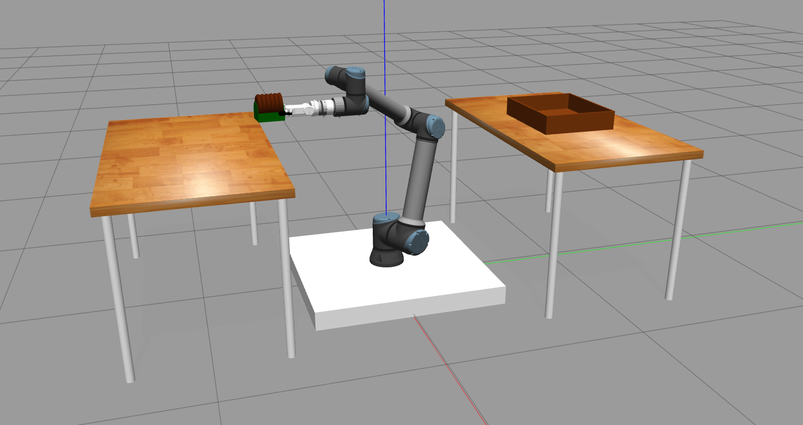

# Lebkuchen Pick-and-Place Simulation



## Overview
Prototype ROS/Gazebo simulation for a confectionery pick-and-place task.

## Features
- Basic motion planning (joint + Cartesian)
- Grasping via Gazebo link attacher
- Simplified industrial workflow

## Limitations / Next Steps
- No perception integration yet
- Grasping not robust to pose variation
- Could be improved with MoveIt pipeline + vacuum gripper model
# ROS1_UR10e Workspace
A ROS1 workspace for controlling the ur10e and OnRobot attachments

# Starting the simulation
# source the workspace in each terminal
```bash
cd ros1_ur10e/
source devel/setup.bash
roslaunch ur10e_sim full_robot.launch
roslaunch ur10e_sim moveit.launch
LIBGL_ALWAYS_SOFTWARE=1 roslaunch moveit_config moveit_rviz.launch
rosrun ur10e_sim pick_and_place_node.py
```